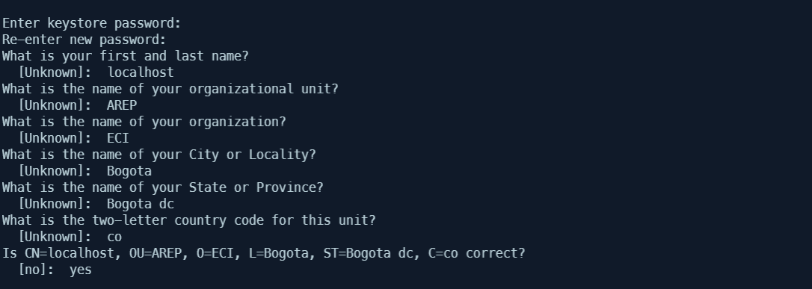
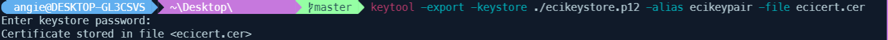
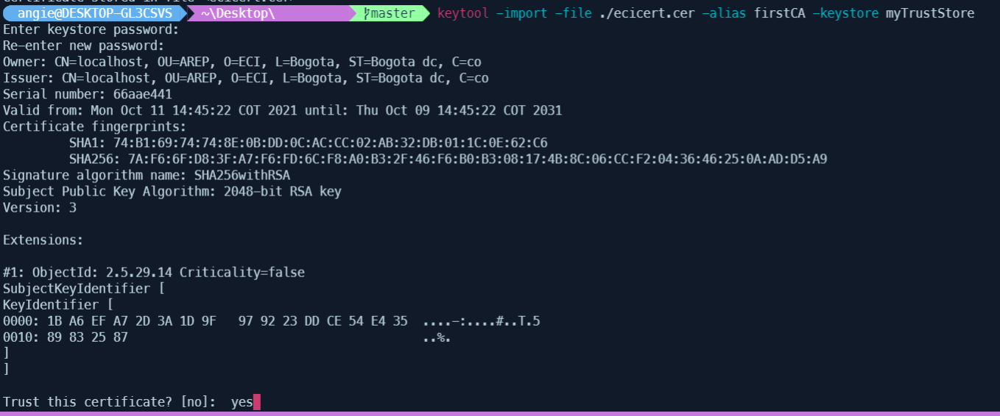
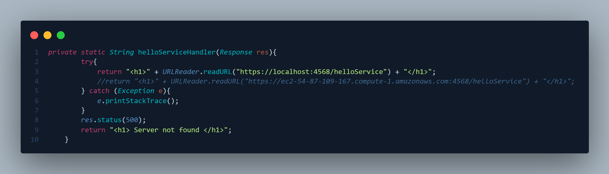
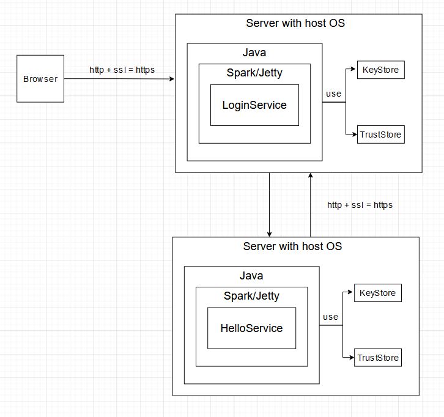
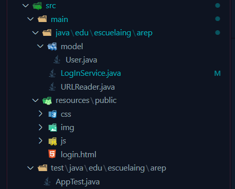
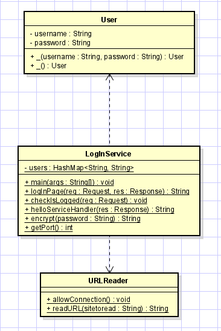
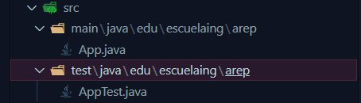

# Aplicación distribuida segura en todos sus frentes


## Comenzando 🚀

A continuación se presentarán series de instrucciones para que se pueda tener un funcionamiento en maquina local del proyecto
### Pre-requisitos 📋
Para el correcto funcionamiento en un ambiente de desarrollo se deberán tener instaladas las siguientes tecnologías:  
* [Git](https://git-scm.com/) - Software de control de versiones
* [Java 8](https://www.java.com/es/download/ie_manual.jsp) - Entorno de desarrollo
* [Maven](https://maven.apache.org/) - Manejador de dependencias
* [Spark](https://sparkjava.com/download) - Micro framework para el desarrollo de aplicaciones web en Java

Ademas se deberan crear las llaves y credenciales, esto se logra siguendo los siguientes pasos para cada proyecto desde su fichero raiz 
1. **Borrar el contenido de la carpeta keystores**
2. **Crear una llave**
    ```
        keytool -genkeypair -alias ecikeypair -keyalg RSA -keysize 2048 -storetype PKCS12 -keystore ecikeystore.p12 -validity 3650
    ```

2. **Ingresar la contraseña que tendra la llave**
En este caso 123456 (asi es como esta en el codigo, en caso de cambiarla debera cambiar las lineas en la que esta contraseña esta quemada)  

3. **Ingresar los datos que tendra la llave**
Para que funcione correctamente en el contexto local se debera poner como primer y segundo nombre ```localhost```, y a continuación se pedira el nombre de la unidad, la organización, ciudad, providencia, el codigo del pais para al final pedir una confirmación de que los datos son los desados



3. **Guardar el certificado**
Se pedira la clave de la llave definida anteriormente  
    ```
        keytool -export -keystore ./ecikeystore.p12 -alias ecikeypair -file ecicert.cer
    ```
    
3. **Se añade el certificado a los certificados confiados**
    ```
        keytool -import -file ./ecicert.cer -alias firstCA -keystore myTrustStore
    ```
    


### Instalación 🔧


1. **Clonar el proyecto LogInService**
    ```
    git clone https://github.com/AngieMeG/AREP-LAB6-LoginService.git
    ```

2. **Clonar el proyecto OtherService**
    ```
    git clone https://github.com/AngieMeG/AREP-LAB6-OtherService.git
    ```
2. **Compilar ambos proyectos**
    ```
    mvn package
    ```
3. **Ejecutar la aplicación OtherService**  
Desde el fichero raiz del proyecto
    * Para entornos Windows
        ```
        java -cp "target/classes;target/dependency/*" edu.escuelaing.arep.App
        ``` 
    * Para entornos Unix
        ```
        java $JAVA_OPTS -cp target/classes:target/dependency/* edu.escuelaing.arep.App
        ```
4. **Ejecutar la aplicación LogInService**  
    Desde el fichero raiz del proyecto
    * Para entornos Windows
        ```
        java -cp "target/classes;target/dependency/*" edu.escuelaing.arep.LogInService
        ``` 
    * Para entornos Unix
        ```
        java $JAVA_OPTS -cp target/classes:target/dependency/* edu.escuelaing.arep.LogInService
        ```
4. **Servicio Web**
Una vez que se tengan las dos instancias corriendo, se deberá descomentar la linea con la URL del localhost y comentar la linea con el URL de la maquina de AWS, viendose asi

Ahora en el browser de preferencia se ingresa
    ```
    https://localhost:4567
    ```
## Ejecutando las pruebas ⚙️

Para la ejecución de las pruebas en cada proyecto
```
mvn test
```
## Arquitectura
Viendo la aplicación completa la arquitectura es de esta manera

Se trabajó en repositorios aparte cada servicio
* LoginService
    * La estructura del servicio es la siguiente
    
    * La relación de las clases:
        * **User:** Es usado para mapear la data que se resibe del front-end
        * **LogInService:** Es el servidor de la parte del LogIn, por lo que se encarga de recibir las peticiones realizadas, asi mismo como verificar si las credenciales provistas son correctas y si es el caso hacer un llamado al otro servidor
        * **URLReader:** Es usado para la comprovación y lectura de un servicio seguro, dadas las credenciales en el archivo *myTrustStore*
    
    * Link al repositorio: [AQUI](https://github.com/AngieMeG/AREP-LAB6-LoginService)
* HelloService
    * La estructura del servicio es la siguiente
    
    * La clase **App** es el servidor del otro servicio, por lo que se encarga de recibir y responder las peticiones realizadas.
    * Link al repositorio: [AQUI](https://github.com/AngieMeG/AREP-LAB6-OtherService)
## Despliegue 📦
El despliegue se realizo en dos maquinas distintas de AWS (una por cada servicio)
 [AQUI](Video.mp4) un video demostrativo

## Extensibilidad 📁
En aras de contruir un producto más completo se puede agregar un servicio de base de datos en el que se guarde la contraseña de los usuarios encriptada (MD5) pues actualmente esto se encuentra quemado en el codigo (esta practica no es nada segura).
## Construido con 🛠️

* [Maven](https://maven.apache.org/) - Manejador de dependencias
* [Spark](https://sparkjava.com/download) - El framework web usado
* [JQuery](https://jquery.com/) - Libreria JavaScript para el manejo del DOM
* [Bootstrap](https://getbootstrap.com//) - Biblioteca multiplataforma o conjunto de herramientas de código abierto para diseño de sitios y aplicaciones web
* [KeyTool](https://docs.oracle.com/javase/8/docs/technotes/tools/unix/keytool.html) - Administra un almacén de claves (base de datos) de claves criptográficas, cadenas de certificados X.509 y certificados de confianza. 
* [AWS](https://aws.amazon.com/es/) - Amazon Web Services es una colección de servicios de computación en la nube pública que en conjunto forman una plataforma de computación en la nube, ofrecidas a través de Internet por Amazon.com
* [EC2](https://aws.amazon.com/es/ec2/?ec2-whats-new.sort-by=item.additionalFields.postDateTime&ec2-whats-new.sort-order=desc) - Amazon Elastic Compute Cloud (Amazon EC2) es un servicio web que proporciona capacidad informática en la nube segura y de tamaño modificable. Está diseñado para simplificar el uso de la informática en la nube a escala web para los desarrolladores
* [JUnit](https://junit.org/junit5/) - Herramienta para pruebas unitarias en Java

## Documentación 📖
La documentación de cada proyecto se encuentra:
* [LogInService](LogServiceDocumentation)
* [HelloService](HelloServiceDocumentation)

## Autores ✒️

* **Angie Tatiana Medina Gil**

## Licencia 📄

Este proyecto está bajo la Licencia GNU General Public License mire el archivo [LICENSE.md](LICENSE.md) para detalles
